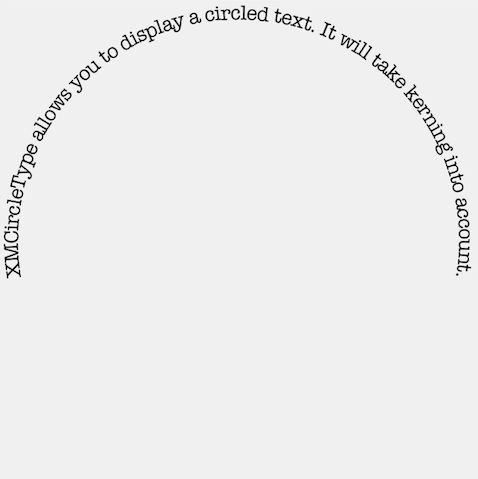

# Introduction

**XMCircleType** was written by **[Michael Teeuw](https://twitter.com/michmich)**

## What is it?

`XMCircleTypeView` is a UIView that allows you to display a String as a circular text. It will take font kerning into account, so no weird spacings. It is a Swift port of my [earlier Objective-C version](https://github.com/MichMich/XMCircleType).

## So what does it look like?

<!-- Remote -->
<!--  -->
<!-- Local -->

## Install

Download the example project and copy the XMCircleTypeView.swift file to your project.

## Usage

Just add a `XMCircleTypeView` to your project, and set the desired options.
Please take a look at the example for more info.

## Contributing

Forks, patches and other feedback are welcome.